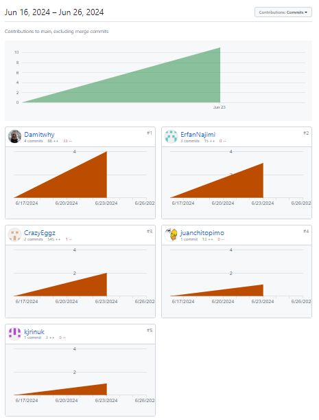

# Welcome,

This is the our.

## Git-collab-Practice repo

This Repo was set up by Dan Feng with collaborators CrazyEggz (Dan Feng), Damitwhy, ErfanNajimi, juanchitopimo, kjrinuk and guest star Aaron_BC.

The repo was created to test the collaborators github merge, pull and push requests and to practice git usage on the GIthub platform.

## Merges

Each of the collaborators were required to create a new branch create some content to push to github repo so that they could take it in turns to do their git pull requests and merge eachothers branches to the main...

## Github Restrictions

For the repository options were selected in settings to restrict push requests to be reviewed by a collaborator who'd not submitted the pull request.

this was inplace to force real collaoration and invite collaborators to develope their github skills and to build the skills required of future employers.

## Out Comes

As a collaborator to this project/practice I was happy with the new skills I'd developed.

Having been team lead on our first hackathon, the responsibility for pull requests and git merging fell to me the repo owner but during this practice I felt shared responsiblity toward the git transactions and learnt that it's ok to just trust the process.

One frustration I had was waiting on others to review my code, so much so (Waiting 8 hours now for review) that I'd decided to clone our old repo and merge my branch to the repo created in my own repositories... 😅 My excuse is it was the only way to deploy and test the contritbutions I'd made. The Script.js is mine and to get it to work obviously the Style.css and Index.html had to include divs, ID's and some styling... I know its not the best I couldnt of done but I'm learning only as quickly as my contributions are being reviewed and merged.

## Credits

Without the help of all the contributors above this repo would be fairly empty so all credits are due to our collaberative efforts.

Github Co-pilot was a great help with suggestions to code fixes and features.

The Youtube video tutorial https://youtu.be/q32skvBgxo4?si=3_KCSiuFjF9B3xYe was the inspiration for the Arrow key functions game, shared by Bro Code on his channel https://www.youtube.com/@BroCodez .

Without channels like those of Bro Code it would be a lot harder for students like myself to work out the javascript code in our course work.

## Happy Coding

Wishing you all the very best in your navigation of coding and learning the Full-Stack programming languages.